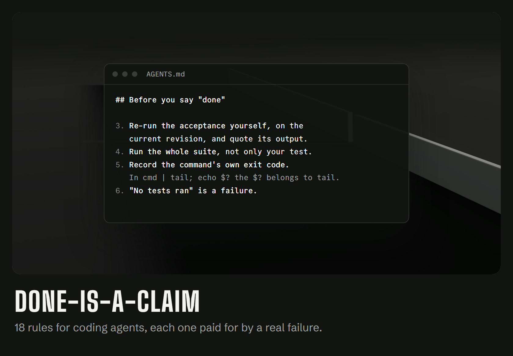

# Done is a claim

[English](README.md) · **Türkçe**



**Kod yazan yapay zekâ ajanları için 18 kural ve 3 skill. Her biri gerçek bir hatanın bedeli.**

Ajanınız "bitti" der. Çoğu zaman bitmiştir. Bazen testler hiç çalışmamıştır, çıkış kodu `tail`'e aittir ya da düzeltme dört çağrı noktasından yalnızca birine ulaşmıştır. Bu kurallar, ajanın o kelimeyi söylemeden önce kanıtını göstermesini sağlar.

Kuralları kendi depomuzda Claude Code ve Codex ajanları çalıştırırken yazdık. 14-29 Eylül 2026 arasında bir sunucu, ajanların bitirdiği **3.489** görevin kabul komutunu yeniden çalıştırdı: **2.282** görev bu ilk bağımsız denemede geçti. Ayrıca **736** görev kendi testini geçtiği hâlde ana daldaki test setinin tamamını kırdı. Her kuralın arkasındaki olay [INCIDENTS.md](INCIDENTS.md) dosyasında, her rakamın kaynağı [CLAIMS.md](CLAIMS.md) dosyasında.

## Kullanım

[AGENTS.md](AGENTS.md) dosyasını deponuzun köküne kopyalayın. Codex ve `AGENTS.md` okuyan diğer ajanlar onu olduğu gibi kullanır.

Claude Code için [CLAUDE.md](CLAUDE.md) dosyasını da kopyalayın. İçinde tek satır var, `@AGENTS.md`; kuralları içeri aktarır.

Zaten bir `AGENTS.md` ya da `CLAUDE.md` dosyanız varsa kuralları kendi metninizin altına yapıştırın.

## Kurallar

**Başlamadan önce**
1. Kabul komutunu işten önce yazın ve geçsin diye sonradan değiştirmeyin.
2. Size verilen her yolun gerçekten var olduğunu kontrol edin.

**"Bitti" demeden önce**
3. Kabul komutunu güncel sürümde kendiniz yeniden çalıştırın ve çıktısını aktarın.
4. Yalnızca kendi testinizi değil, test setinin tamamını çalıştırın.
5. Pipe'ın değil, komutun kendi çıkış kodunu kaydedin.
6. "Hiç test çalışmadı" bir başarısızlıktır.
7. Bilinmiyor, geçti demek değildir.
8. Yeşil, her kontrolün yeşil olması demektir.

**Rapor verirken**
9. Özeti değil, asıl çıktıyı okuyun.
10. Var olan bir dosya, çalışan bir dosya değildir.
11. Kendi gözünüzle bakın.
12. Gösterdiğiniz her kaynağı doğrulayın.
13. Hangi sürümde ölçtüğünüzü yazın ve yayımlamadan önce yeniden kontrol edin.

**Test ve düzeltme yazarken**
14. Bir sabiti tekrarlayan test hiçbir şey kanıtlamaz.
15. Tek örneği değil, hata sınıfının tamamını düzeltin.
16. Bir dedektörü önce iyi olduğunu bildiğiniz bir örnekte çalıştırın.
17. Temizlik kodunu, temizlediği işten önce kaydedin.

**Asla**
18. Bir soruyu yanıtlamak için yıkıcı bir komut çalıştırmayın.

## Skill'ler

Kurallara uymanın en zor olduğu anlar için üç skill:

| Skill | Ne zaman |
|---|---|
| [reading-measurements](skills/reading-measurements/SKILL.md) | bir rakamı raporlamadan önce: çıkış kodu, test sayısı, yeşil sonuç, liste boyutu |
| [whose-red](skills/whose-red/SKILL.md) | testler kırıldığında ve kimin hatası olduğuna karar verilmesi gerektiğinde: değişikliğin mi, ana dalın mı? |
| [public-claims](skills/public-claims/SKILL.md) | içinde rakam geçen bir README, sürüm notu ya da duyuru yazarken |

Claude Code için bir skill'in klasörünü deponuzdaki `.claude/skills/` içine, ya da bütün projeler için `~/.claude/skills/` içine kopyalayın:

```bash
git clone https://github.com/Grit-77/done-is-a-claim
cp -r done-is-a-claim/skills/* ~/.claude/skills/
```

Her skill tek bir Markdown dosyasıdır; başka bir ajana da doğrudan gösterilebilir. Skill metinleri İngilizcedir.

## Kural, kapı değildir

Prompt'taki bir kural tavsiyedir; ajan yine de atlayabilir. O kapıyı ayrı bir araç olarak kurduk: RADAR, bir görevin kabul komutu güncel sürümde yeniden geçmeden görevi kapatmaz. Bu kurallar, işin tek dosyaya sığan kısmıdır.

## Katkı

Size gerçek bir hataya mal olmuş bir kuralınız mı var? Olayla birlikte bir issue açın: ajan ne iddia etti, gerçek neydi, farkı hangi rakam ya da çıktı gösterdi. Arkasında olay olmayan kural eklenmez.

## Lisans

Apache-2.0. [Grit](https://grit.grit-77.workers.dev/tr/), Ankara. Ayrıca: [cinematic-site](https://github.com/Grit-77/cinematic-site), kontrol edilerek teslim edilen web siteleri için bir skill seti.
