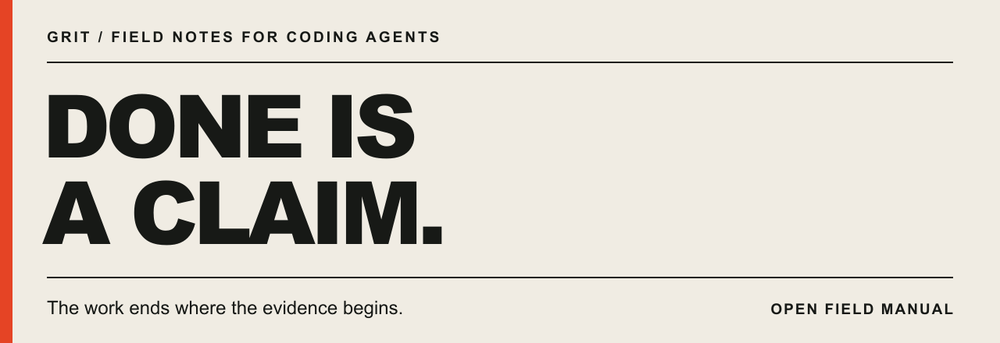
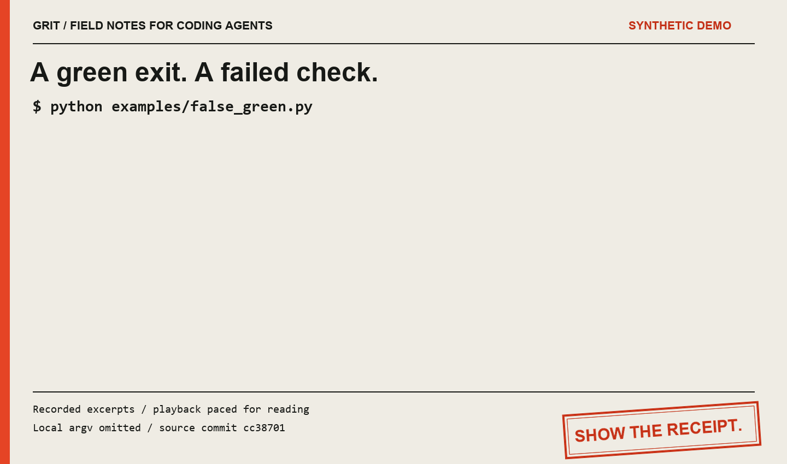

# Done is a claim

[English](README.md) · **Türkçe**

<picture>
  <source media="(prefers-reduced-motion: reduce)" srcset="assets/receipt.svg">
  
</picture>

[Damgayı tekrar oynat](assets/receipt-stamp.gif) · [Hareketsiz kapak](assets/receipt.svg)

**Ajanınız “bitti” diyor. Bunu ne kanıtlar?**

Kod yazan ajanlar için kanıta dayalı geliştirme akışı: **anla → planla → uygula →
hata ayıkla → incele → doğrula → teslim et**. Birbirine bağlı 13 skill, gerçek
olaylardan çıkarılmış 18 kural ve kanıtı test edilen çalışmaya bağlayan isteğe
bağlı yerel araçlar. Küçük işler daha kısa yoldan ilerler.

[Başlayın](#başlayın) · [İş akışını görün](docs/WORKFLOW.md) · [Skill seçin](#skill-seçin) · [Demoyu deneyin](#yanlış-bir-yeşil-sonucu-görün)

## Yanlış bir yeşil sonucu görün

Yerel örneği **Python 3.10 veya üzeriyle** deneyin:

```bash
git clone https://github.com/Grit-77/done-is-a-claim.git
cd done-is-a-claim
python examples/false_green.py
```

**Sentetik demo:** doğrulayıcı **1** çıkış koduyla başarısız olur; özetleyici
çıktıyı gösterir ve **0** ile çıkar. Kayıt, doğrulayıcının sonucunu izler ve
**FAIL** der. Demonun kendisi, farkı ortaya çıkardığı için **0** ile çıkar;
bu, doğrulayıcının geçtiği anlamına gelmez.

<picture>
  <source media="(prefers-reduced-motion: reduce)" srcset="assets/demo/false-green-recorded.png">
  
</picture>

[Çalıştırılabilir kaynak](examples/false_green.py) · [Hareketsiz kanıt](assets/demo/false-green-recorded.png) · [Kayıt ve sınırlar](docs/demo-recording.md)

Kaydedilen çıktıdan alıntılar, okunabilmesi için yavaş gösterilir. Bu sentetik
bir örnektir; üretim sistemi günlüğü veya ajan performansı ölçümü değildir.

## Başlayın

Kod yazan ajanınıza şu isteği verin:

> https://github.com/Grit-77/done-is-a-claim bunu kur. Sonra neyin değiştiğini,
> ne işe yaradığını ve nasıl kullanmaya başlayacağımı basitçe anlat.

**Kurulumu yapan ajan için:** [INSTALL.md](INSTALL.md) yönergesini izle.
Kullanılan ajanı ve kurulum kapsamını belirle, mevcut çalışmayı koru, sonucu
doğrula ve kullanıcının dilinde kısa bir açıklamayla bitir.

### Elle kurulum

Tüm skill’leri native plugin olarak kurun:

**Claude Code**

```bash
claude plugin marketplace add Grit-77/done-is-a-claim --scope local
claude plugin install done-is-a-claim@done-is-a-claim-marketplace --scope local
```

**Codex**

```bash
codex plugin marketplace add Grit-77/done-is-a-claim
codex plugin add done-is-a-claim@done-is-a-claim-marketplace
```

Yeni bir oturum açın. Claude Code’da `/done-is-a-claim:using-done-is-a-claim`
komutunu kullanın; Codex’te `/skills` veya `$` seçicisinden
`using-done-is-a-claim` skill’ini seçin.
[Plugin kapsamı, güncelleme ve doğrulama sınırları →](docs/PLUGINS.md)

Proje içine kopyalamak veya yalnızca kuralları kullanmak için yukarıdaki demo
adımında oluşturduğunuz klonu kullanın:

| Kullandığınız ajan | Projenize ekleyin |
|---|---|
| Codex veya `AGENTS.md` okuyan bir ajan | [AGENTS.md](AGENTS.md) dosyasını projenin köküne kopyalayın. |
| Claude Code | [AGENTS.md](AGENTS.md) ile onu `@AGENTS.md` üzerinden içeri aktaran [CLAUDE.md](CLAUDE.md) dosyasını kopyalayın. |
| Mevcut talimatlarınız varsa | İlgili kuralları dosyanıza ekleyin. Projeye özel komutları ve kısıtları koruyun. |

Tek kural dosyasıyla başlayabilirsiniz. Native plugin kurulumu, bu kuralları
projenizin talimat dosyalarına eklemez.
[macOS, Linux veya Windows için kurulum seçenekleri →](docs/INSTALL.md)

Mevcut dosyaların üzerine yazmadan proje içine iş akışını kurmak için bu klonun
kökünde aşağıdaki planı çalıştırın. `../my-project` yerine mevcut proje yolunuzu yazın:

```bash
python tools/install_skills.py --project ../my-project --agent codex --profile workflow --dry-run
```

Kurmak için `--dry-run` seçeneğini kaldırın. Claude Code için `--agent claude-code`
kullanın. Mevcut skill hedefleri reddedilir; proje talimatlarınız korunur.
Profilleri ve tek tek skill’leri görmek için `--list` kullanın. Açıkça verilen
`--update`, kurucunun oluşturduğu değişmemiş kopyaları yedekleyerek günceller;
yerel değişiklik varsa işlemi reddeder.

Kendi projenizde ilk olarak şu isteği deneyin:

> Bu iş için using-done-is-a-claim kullan. Gözlemlenebilir kabul koşulunu belirle,
> işin boyutuna uygun şekilde uygula ve incele. Gerçek sonucu, test edilen
> girdileri ve eksik kontrolleri bildir. Verdiğim yetki kapsamında ilerlemeyi sürdür.

Bu, ajanın isteği anlayıp anlamadığını kontrol eder. Talimatlara uymasını zorunlu
kılmaz.

## Tek akış, kısa yollar

[using-done-is-a-claim](skills/using-done-is-a-claim/SKILL.md) ile başlayın.
Kapsamlı işler planlama ve uygulamadan geçer; beklenmeyen sonuçlar hata ayıklamaya
yönlenir. İnceleme bulguları düzeltme ve yeniden kontrolle kapanır. Küçük ve açık
bir değişiklik doğrudan uygulama, inceleme ve doğrulamaya gider. Alt ajanlar
isteğe bağlıdır; bağımsız inceleyici yoksa öz incelemenin sınırı açıkça belirtilir.

[Akış şeması ve örnek görev →](docs/WORKFLOW.md)

Kurulumu gerçek bir görevde denemek için bu reponun klonunda küçük ve hatalı bir CSV projesi oluşturun,
kurulu skill’inizle düzelttirin, ardından sonucu bağımsız kontrol edin:

```bash
python tools/native_smoke.py create --project ../claim-smoke
python tools/native_smoke.py verify --project ../claim-smoke --json
```

Başlangıçtaki dar testler geçse bile bağımsız kontrol bilerek başarısız olur.
Araç yalnızca deneme projesini oluşturur ve kontrol eder; ajanı normal uygulamanız
ve hesabınız üzerinden siz çalıştırırsınız.
[Gerçek oturum adımları ve gözlenen sınırlar →](docs/NATIVE-TESTS.md)

## Teslim edilen dosyayı kontrol edin

Başarılı bir kopyalama da yanlış dosyayı teslim edebilir.
[Teslim demosu](examples/wrong_delivery.py), eski bir kopyayı, doğru kopyayı ve
baytları aynı olduğu hâlde ayrıştırılamayan bir dosyayı karşılaştırır:

```bash
python examples/wrong_delivery.py
```

Geçici yerel dosyalar kullanır. Sıfır çıkış kodu, bu tuzakların gösterildiğini
belirtir; gerçek bir teslimin başarılı olduğunu değil.

## Komutun sonucunu kaydedin

İsteğe bağlı yerel araçla komutun kendi çıkış kodunu, tam çıktısını ve Git durumunu
kaydedin:

```bash
python tools/receipt.py -- python tools/run_tests.py
```

Her çalıştırma için `.local/receipts/` altında yeni bir `receipt.json` ve
`command.log` oluşturur. Seçtiğiniz dosyaların önceki ve sonraki parmak izlerini
karşılaştırmak için `--input` kullanın. Sıfır çıkış kodu komutun başarıyla
tamamlandığını kaydeder; kullanıcının görevinin bittiğine karar vermez.
Seçilmiş girdiler yoksa kayıt, güncelliği yeniden kontrol etmek için eksik kalır.
[Kullanım, kontrol edilen girdiler ve sınırlar →](docs/RECEIPTS.md)

Bir düzenleme veya devir sonrasında eski kaydı yeniden kullanacaksanız, aracın
daha önce yazdırdığı `receipt.json` yolunu kullanarak güncel projeyle karşılaştırın:

```bash
python tools/check_receipt.py path/to/receipt.json --project .
```

[Neler yeniden kontrol edilir, eşleşme neleri kanıtlamaz? →](docs/RECHECK.md)

## Raporda ne değişir?

| İddia | İddiayı destekleyebilecek kanıt |
|---|---|
| “Testler geçti.” | Komut, bulunan testler, gerçek sonuç, komutun kendi çıkış kodu ve test edilen çalışma ağacı. |
| “Bu hata zaten ana dalda vardı.” | Dalda ve temiz temel sürümde yapılmış karşılaştırılabilir çalıştırmalar; eşleşen hata belirtileri. |
| “Alt ajan işi bitirdi.” | Alt ajanın gerçek değişiklikleri, kontrol edilen girdiler ve kabul sonucu. Teslim durumu ayrıca kaydedilir. |
| “Ekran görüntüsü kaydedildi.” | Açılabilen ve görsel olarak incelenmiş bir görüntü. |
| “Yayımlamaya hazır.” | İncelenen dosyalarla yayımlanacak dosyaların hâlâ aynı olması. |

[Tamamlama kaydı](templates/completion-receipt.md),
[kabul brief'i](templates/acceptance-brief.md) ve
[devir notunu](templates/handoff.md) küçük, tekrar kullanılabilir biçimler olarak
kullanın. Yapılmayan kontrol de raporda yer almalıdır.

[Bash ve PowerShell için pratik kanıt toplama örnekleri →](docs/RECIPES.md)

## Skill seçin

| Karşılaştığınız durum | Kullanılacak skill | Karar vermenize yardımcı olduğu soru |
|---|---|---|
| İşe tek bir giriş noktasından başlamak istiyorsunuz | [using-done-is-a-claim](skills/using-done-is-a-claim/SKILL.md) | Görev, yetki ve mevcut kanıta göre yararlı sonraki adım ne? |
| Değişiklik kapsamlı veya bağımlılıklar içeriyor | [planning-changes](skills/planning-changes/SKILL.md) | Hangi görevler, sorumlular ve gözlemler istenen sonuca ulaştırır? |
| Planda uygulanabilir, yetkilendirilmiş işler var | [executing-plans](skills/executing-plans/SKILL.md) | Şimdi ne ilerleyebilir, her görevi hangi kanıt kapatır? |
| Davranış beklentiyle çelişiyor | [debugging-with-evidence](skills/debugging-with-evidence/SKILL.md) | Olası nedenleri hangi deney ayırt eder? |
| Değişiklik incelemeye hazır | [reviewing-changes](skills/reviewing-changes/SKILL.md) | Gerçek değişiklik isteği karşılıyor mu; bulgular giderilip yeniden kontrol edildi mi? |
| İşin hangi durumda “geçti” sayılacağı belirsiz | [acceptance-design](skills/acceptance-design/SKILL.md) | Bu kontrol, kullanıcının gerçekten önemsediği sınırı aşıyor mu? |
| Bir rakam ikna edici görünüyor | [reading-measurements](skills/reading-measurements/SKILL.md) | Bu çıktı neyi kanıtlıyor, neyi belirsiz bırakıyor? |
| Dalınızda bir test başarısız oluyor | [whose-red](skills/whose-red/SKILL.md) | Yeni bir hataya, mevcut bir hataya veya henüz çözülememiş bir nedene işaret eden karşılaştırılabilir kanıt var mı? |
| Bir alt ajan başarı bildiriyor | [collecting-worker-results](skills/collecting-worker-results/SKILL.md) | İlgili bir değişiklik var mı, test edildi mi ve teslim edildi mi? |
| Kontrolden sonra iş değişti | [evidence-freshness](skills/evidence-freshness/SKILL.md) | Sonuç kaydı, işlem yapacağınız girdileri hâlâ doğru anlatıyor mu? |
| Bir README veya duyuru iddia içeriyor | [public-claims](skills/public-claims/SKILL.md) | Okur iddianın kaynağına ulaşabiliyor mu ve doğrulamanın sınırları belirtilmiş mi? |
| Yarım kalan bir işi devralıyorsunuz | [resuming-work](skills/resuming-work/SKILL.md) | Hangi kayıt, çıktı ve sonraki adım bu çalışma kopyasında hâlâ geçerli? |
| Bir gönderim veya yayımlama başarı bildiriyor | [checking-delivery](skills/checking-delivery/SKILL.md) | Gerçek hedefte incelenen sonuç mu var ve kullanılabiliyor mu? |

Her skill bağımsız bir `SKILL.md` dosyasıdır. Grit servisi, hesabı veya CLI'ı
gerekmez. Skill metinleri İngilizcedir.

## Sahadan gelen kurallar

Kuralların tam metni [AGENTS.md](AGENTS.md) dosyasındadır. Her özgün kuralın
arkasındaki hata hikâyesi [INCIDENTS.md](INCIDENTS.md) dosyasında yer alır.

| Aşama | Kurallar |
|---|---|
| **Başlamadan önce** | **01** Kabul koşulunu işten önce belirleyin. **02** Yolları kontrol edin. |
| **“Bitti” demeden önce** | **03** Güncel çalışmada yeniden kontrol edin. **04** Daha geniş test setini çalıştırın. **05** Komutun kendi çıkış kodunu kaydedin. **06** Test çalışmadıysa geçti saymayın. **07** Bilinmiyor, geçti demek değildir. **08** Gerekli kontrollerin hepsini okuyun. |
| **Rapor verirken** | **09** Asıl çıktıyı okuyun. **10** Yazılan dosyayı açın. **11** Kendi gözünüzle bakın. **12** Kaynakları doğrulayın. **13** Temel sürümü belirtin ve yayımlamadan önce yeniden kontrol edin. |
| **Test ve düzeltme yazarken** | **14** Bir sabitle uyumu değil, davranışı test edin. **15** Hata sınıfını düzeltin. **16** Dedektörü iyi olduğunu bildiğiniz bir örnekte sınayın. **17** Temizliği işten önce kaydedin. |
| **İşi her zaman koruyun** | **18** Bir soruyu yanıtlamak için asla yıkıcı bir komut kullanmayın. |

## Nereden çıktı?

Bu kurallar, Grit'in kendi deposunda Claude Code ve Codex çalıştırırken oluştu.
Özgün iç kayıtlar, 14–29 Eylül 2026 arasında **3.489** görevin kabul komutunun
yeniden çalıştırıldığını ve **2.282** görevin ilk bağımsız denemede geçtiğini
bildiriyor. Ayrı bir iç sayımda, kendi kabul kontrolünü geçtiği hâlde ana daldaki
test setinin tamamını bozan **736** görev raporlanıyor.

**Bunlar yazarın bildirdiği tarihsel gözlemlerdir; kamuya açık bir karşılaştırma
testi değildir.** Ham iç günlükler bu depoda bulunmaz. Başarısız denemelerin bir
kısmı ortam sorunlarından kaynaklanmıştır; bu rakamlar bir ajan hata oranı veya
bu araç setinin etkinliğini kanıtlamaz. [İddialar ve sınırları →](CLAIMS.md)

Ek iş akışları, Grit'in operasyon yönergelerinden derlenmiştir. Yeni ölçülmüş
olaylar olarak değil, rehberlik olarak tanımlanırlar. İlgili projelerin kurulum,
skill ve doğrulama düzenlerini de inceledik.
[Kaynaklar ve tasarım kararları →](SOURCES.md)

## Yanıltmayı deneyin

Bir ajan kuralı tekrar edip yine de yanlış karar verebilir.
[Senaryo paketi](evals/README.md), talimatları zor durumlarda sınar: başarılı
görünen bir pipe, uyumsuz kontrol koşulları, ilgili hiçbir değişikliği olmayan
bir alt ajan, güncelliğini yitirmiş kanıt ve başka tuzaklar. Katılımcı istekleri
değerlendirici cevap anahtarından ayrı dosyalardadır. İstekleri yeni oturumlarda
çalıştırın ve yanıtları saklayın.

Bunlar elle yürütülen davranış değerlendirmeleridir; yayımlanmış başarı oranı
iddiaları değildir.

Deponun kendisini kontrol etmek için:

```bash
python tools/run_tests.py
python tools/check_repository.py
python tools/check_package.py
```

Test çalıştırıcısı, hiç test bulunmamasını ve testlerin tamamının atlanmasını
başarısız sayar.

Bu kontroller araçları sınar; yerel belge hedeflerini, skill üst bilgilerini ve
içeri aktarımları doğrular. [CI](.github/workflows/check.yml), Windows ve Linux'ta
çalışır. Bu kontrollerin geçmesi, ajanın talimatlara uyduğunu kanıtlamaz.

## Kural, denetim kapısı değildir

Bu depo talimatlar, küçük yerel araçlar, örnekler ve değerlendirme malzemeleri sunar. Ajanın araç
çağrılarına müdahale etmez, birleştirme işlemini engellemez veya dağıtım
politikasını zorunlu kılmaz. Kuralları uygulatmak için projenizin gerçek test ve yayımlama
kontrollerini kullanın.

## Size ders olan hatayı getirin

Yararlı bir katkı, ajanın ne iddia ettiği, gerçekte ne olduğu ve aradaki farkı
hangi kanıtın ortaya çıkardığıyla başlar.
[Bir kural önerin](https://github.com/Grit-77/done-is-a-claim/issues/new?template=new-rule.yml)
veya [katkı rehberini okuyun](CONTRIBUTING.md).

Kendi projenizde denediniz mi? [Somut bir kullanım deneyimi paylaşın](https://github.com/Grit-77/done-is-a-claim/issues/new?template=use-report.yml):
hangi parçayı kullandığınız, ne olduğu ve neyin belirsiz kaldığı.

[Apache-2.0](LICENSE) · [Grit](https://github.com/Grit-77) tarafından hazırlandı, Ankara.
