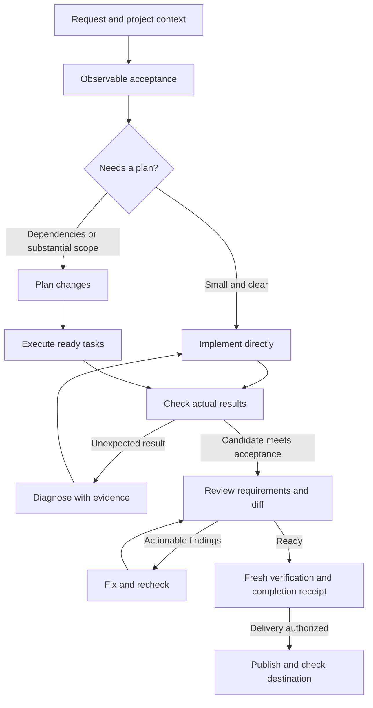

# From request to receipt

Start with **using-done-is-a-claim**. It chooses a proportionate path from the
actual task and evidence. You can install the whole workflow, use the native
plugin, or select a single standalone skill. [Installation](INSTALL.md) ·
[Native plugins](PLUGINS.md)

## Choose the next step

| Situation | Skill | What you carry forward |
|---|---|---|
| Starting or choosing a path | [using-done-is-a-claim](../skills/using-done-is-a-claim/SKILL.md) | Scope, authority, acceptance and the next useful action |
| Unclear meaning of success | [acceptance-design](../skills/acceptance-design/SKILL.md) | Observable behavior and a check that reaches it |
| Dependencies or substantial changes | [planning-changes](../skills/planning-changes/SKILL.md) | Small tasks, ownership, dependencies and expected observations |
| Ready work in an existing plan | [executing-plans](../skills/executing-plans/SKILL.md) | Actual changes, task evidence and remaining work |
| An unexpected result | [debugging-with-evidence](../skills/debugging-with-evidence/SKILL.md) | Reproduction, competing explanations and a discriminating experiment |
| A candidate implementation | [reviewing-changes](../skills/reviewing-changes/SKILL.md) | Findings tied to requirements, locations and consequences |
| Interrupted work | [resuming-work](../skills/resuming-work/SKILL.md) | Verified checkpoint, current ownership and next action |
| Changed inputs or a delivery | [evidence-freshness](../skills/evidence-freshness/SKILL.md), then [checking-delivery](../skills/checking-delivery/SKILL.md) | Evidence for this tree and, if authorized, the actual destination |

The other evidence skills help interpret measurements, attribute failures,
collect worker results and qualify public claims. The
[full catalog](../README.md#choose-a-skill) explains their triggers.

## Try it on a real change

After installing, select `using-done-is-a-claim` using your host's skill picker.
For the Claude plugin, use `/done-is-a-claim:using-done-is-a-claim`.
Then give it a concrete request:

> Add CSV export to the current report screen. Preserve the existing columns and
> active filters. Use the existing project conventions and tests. Implement and
> review the change; include the observed acceptance result and remaining gaps.

A useful acceptance target checks the exported rows for the selected filters,
including quoting and empty results. A test of the button's label alone does not
reach that boundary. The plan should separate the export behavior, UI integration
and relevant checks when they have different dependencies. An unexpected failing
case goes through diagnosis; review findings go through a fix and recheck loop.
The final receipt identifies the tested files or revision and actual results.

This is an illustrative task, not a result from a deployed report application.
For a typo, the same entry skill should take the direct path: inspect the relevant
text, change it, check the diff and links if affected, and report the result.

## Keep the workflow small

- Existing user authorization carries through planning, implementation and review.
  A plan is not a new source of permission. Ask only when missing information or
  authority actually blocks the next action; continue independent authorized work.
- Use workers only when permitted, available and useful. Separate overlapping
  writers. Without workers, execute inline and label self-review honestly.
- Keep one project record using its existing conventions. The optional
  [change plan](../templates/change-plan.md),
  [diagnosis record](../templates/diagnosis-record.md) and
  [review record](../templates/review-record.md) can help with substantial work.
  A tiny change need not create three documents.
- Load related skills only from locations your host actually exposes. If a skill
  is absent, the entry skill's standalone checklist remains usable. Do not invent
  an invocation, install packages automatically or claim an unavailable tool ran.
- Reuse fresh evidence where its inputs and acceptance still match. Re-run affected
  checks after a change. More logs do not compensate for checking the wrong thing.

## What installation does

The plugin exposes all 13 skills for discovery. The local copier supports the
`workflow`, `evidence` and `review` profiles listed in [profiles.json](../profiles.json).
They are selections, not different enforcement levels. The plugin has no lifecycle
hooks, servers or automatic instruction-file edits. Invoke the entry skill to
start; discovery alone does not establish that an agent used it.

The Python tools remain optional commands from a repository checkout; installing
one skill does not install executable commands beside it. Plain Markdown guidance
does not block an unsafe merge or guarantee compliance. Use actual project gates
and [fresh-session scenarios](../evals/README.md) to examine behavior.
